# Graphviz DOT

Graphviz DOT is a powerful graph description language for creating directed and undirected graphs. It excels at complex relationship visualization.

## When to Use DOT

- **Dependency graphs** — Software module dependencies
- **Network topology** — Infrastructure diagrams
- **State machines** — Complex state transitions
- **Organizational charts** — Hierarchies with many levels
- **Decision trees** — Complex branching logic

DOT is ideal when you need more control over layout than Mermaid provides.

---

## Basic Syntax

Wrap your DOT code in a code block with the `dot` language identifier:

````markdown
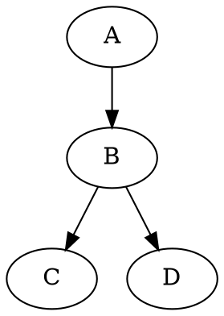
````

---

## Graph Types

### Directed Graph (digraph)

Arrows show direction:

````markdown
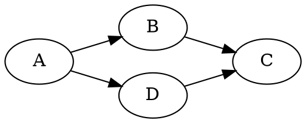
````

### Undirected Graph (graph)

Lines without direction:

````markdown
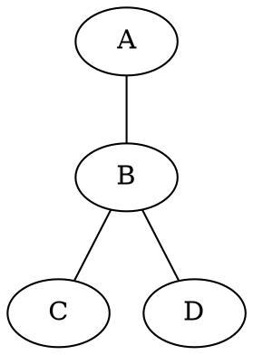
````

---

## Styling Nodes

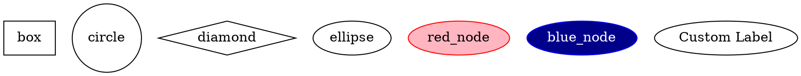

### Common Shapes

| Shape | Description |
|-------|-------------|
| `box` | Rectangle |
| `circle` | Circle |
| `ellipse` | Ellipse (default) |
| `diamond` | Diamond |
| `plaintext` | No border |
| `record` | Record with fields |
| `doublecircle` | Double circle |
| `folder` | Folder icon |
| `cylinder` | Database cylinder |

---

## Styling Edges

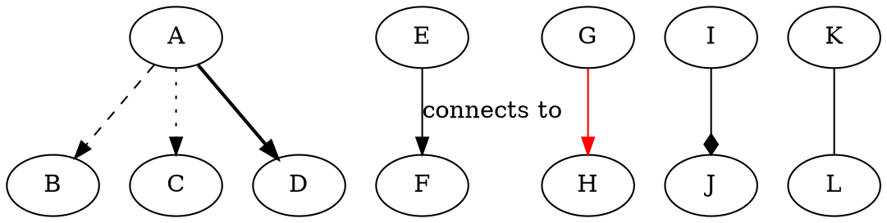

---

## Layout Control

### Direction

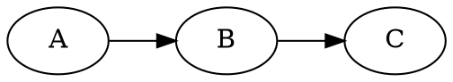

### Clusters (Subgraphs)

````markdown
```dot
digraph G {
    subgraph cluster_frontend {
        label="Frontend";
        style=dashed;
        React; Vue; Angular;
    }
    
    subgraph cluster_backend {
        label="Backend";
        Node; Python; Go;
    }
    
    React -> Node;
    Vue -> Python;
    Angular -> Go;
}
```
````

### Rank Constraints

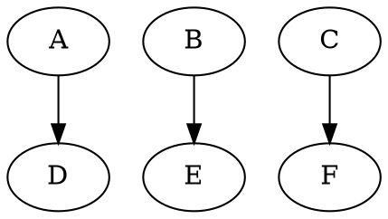

---

## Real-World Examples

### Software Architecture

````markdown
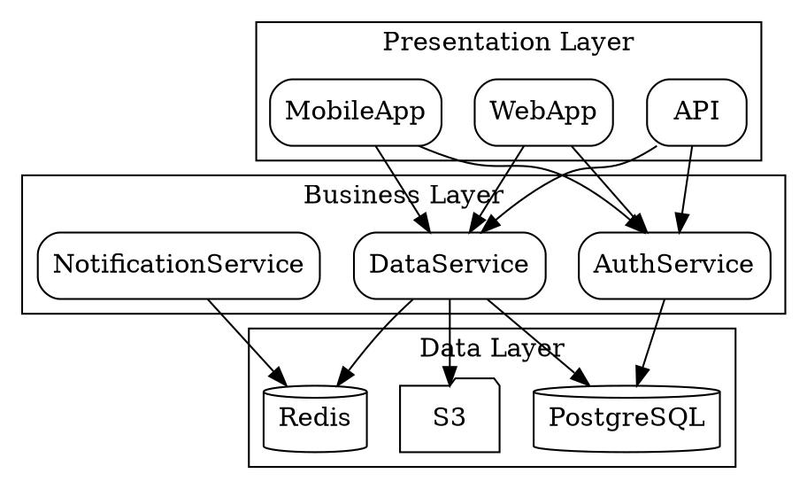
````

### Dependency Tree

````markdown
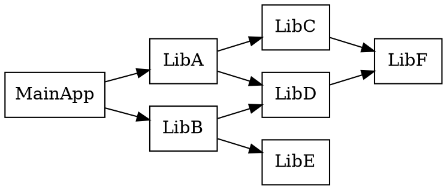
````

### State Machine

````markdown
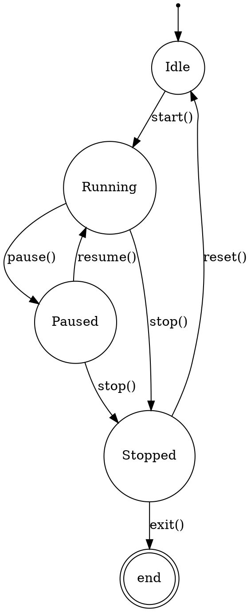
````

---

## Tips for Best Results

### Keep It Simple

- Limit graphs to ~30-40 nodes for clarity
- Use clusters to organize related nodes
- Let Graphviz handle layout when possible

### Use Labels Effectively

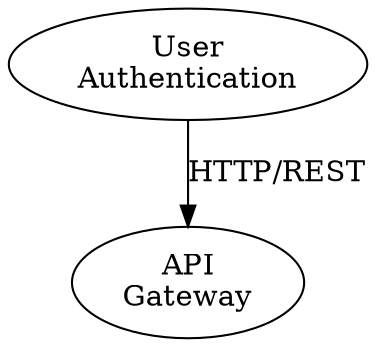

### Control Spacing

```dot
digraph G {
    ranksep=1.0;  // Vertical spacing
    nodesep=0.5;  // Horizontal spacing
}
```

---

## Common Issues

### Graph Too Wide/Tall?

- Change `rankdir` (TB, LR, etc.)
- Use `ranksep` and `nodesep` to adjust spacing
- Split into multiple graphs

### Nodes Overlapping?

- Increase `nodesep` value
- Use `constraint=false` on some edges
- Add invisible edges to guide layout

---

## Learn More

- [Graphviz Official Documentation](https://graphviz.org/documentation/)
- [DOT Language Reference](https://graphviz.org/doc/info/lang.html)
- [Node, Edge and Graph Attributes](https://graphviz.org/doc/info/attrs.html)
