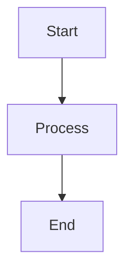
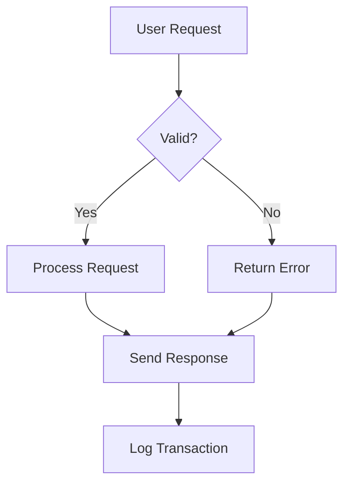
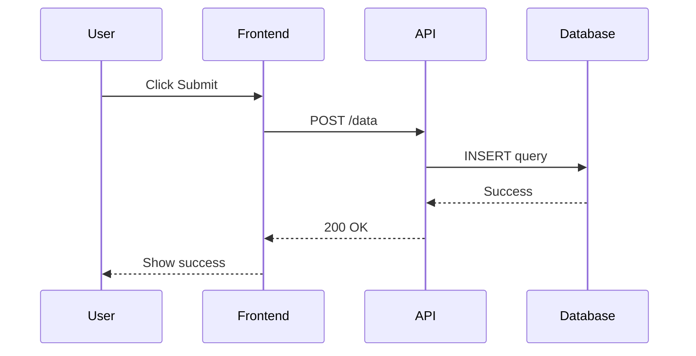
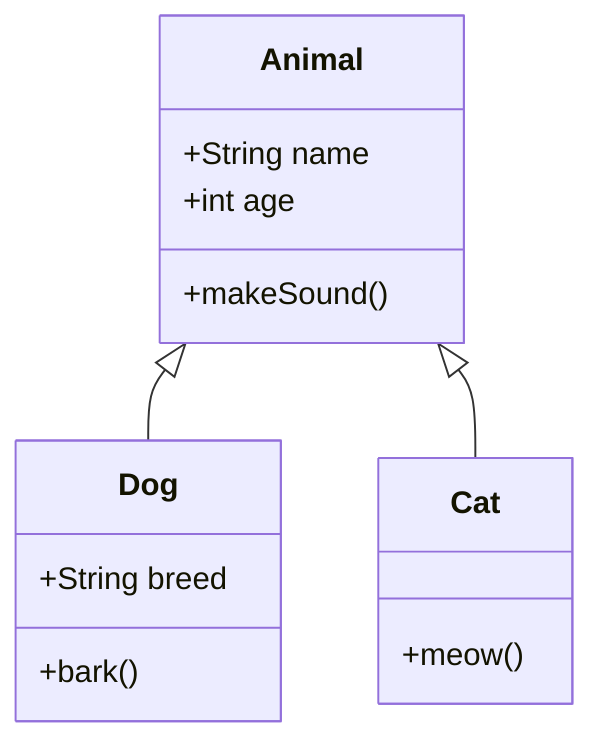
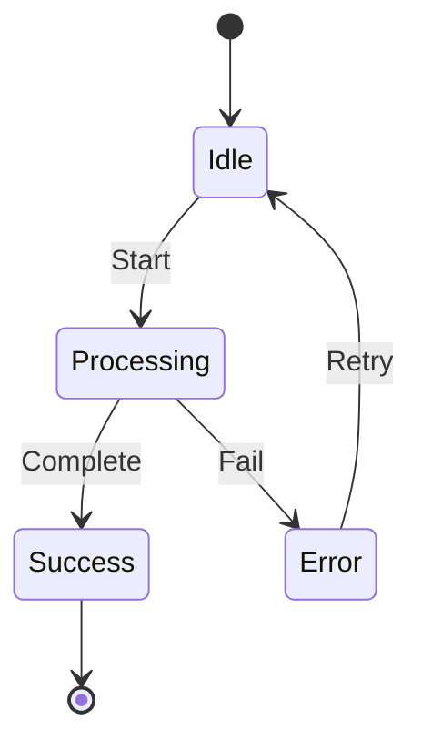
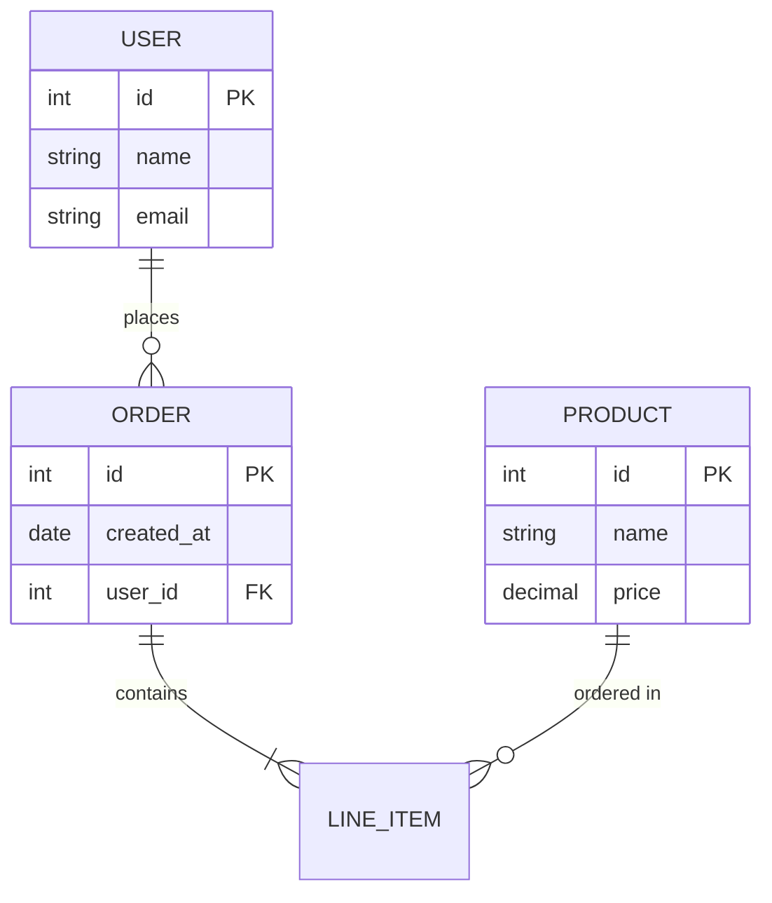
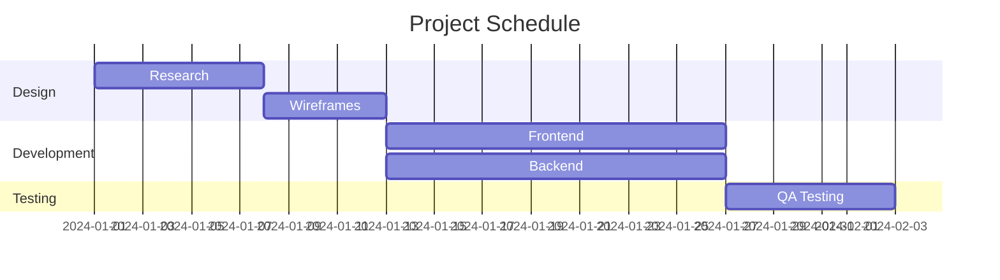
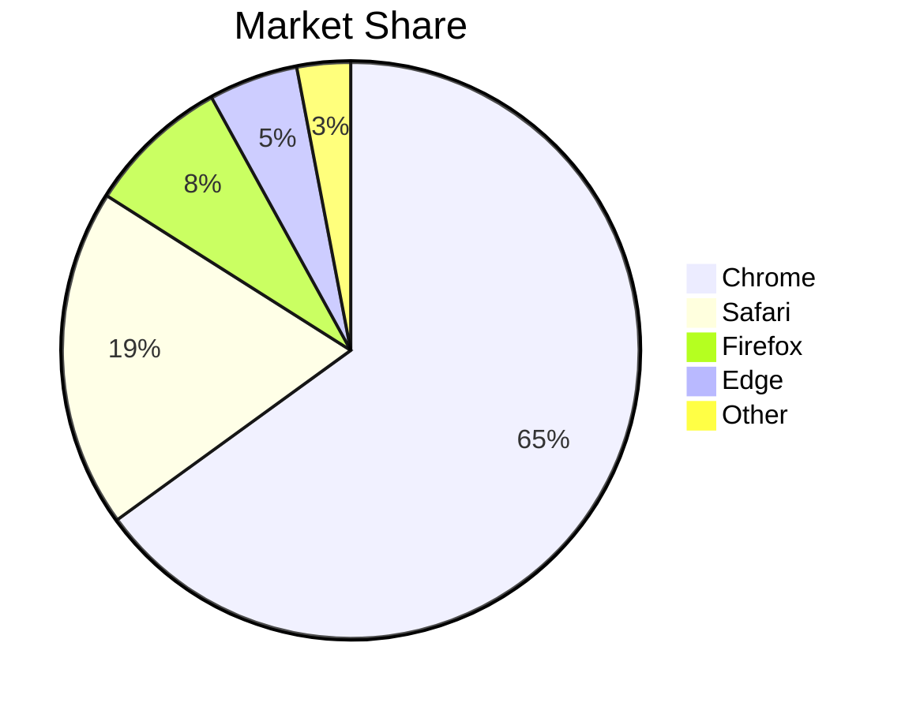
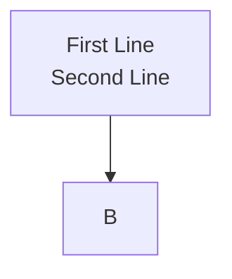

# Mermaid Diagrams

Mermaid is a powerful diagramming tool that lets you create diagrams using text-based syntax. Markdown Viewer has native support for all Mermaid diagram types.

## Supported Diagram Types

- **Flowchart** — Process flows, decision trees
- **Sequence Diagram** — API calls, message flows
- **Class Diagram** — OOP class relationships
- **State Diagram** — State machines
- **Entity Relationship (ER)** — Database schemas
- **Gantt Chart** — Project timelines
- **Pie Chart** — Distribution visualization
- **Git Graph** — Branch visualization
- **Journey** — User journey maps
- **Quadrant Chart** — Four-quadrant analysis
- **Requirement Diagram** — Requirements tracing

---

## Basic Syntax

Wrap your Mermaid code in a code block with the `mermaid` language identifier:

````markdown

````

---

## Flowchart

Create process flows and decision trees.

````markdown

````

### Flow Directions

- `TB` — Top to Bottom
- `BT` — Bottom to Top
- `LR` — Left to Right
- `RL` — Right to Left

### Node Shapes

```
[Rectangle]
(Rounded)
{Diamond}
([Stadium])
[[Subroutine]]
[(Database)]
((Circle))
```

---

## Sequence Diagram

Perfect for documenting API calls and message flows.

````markdown

````

### Arrow Types

- `->` — Solid line
- `-->` — Dotted line
- `->>` — Solid line with arrowhead
- `-->>` — Dotted line with arrowhead

---

## Class Diagram

Document object-oriented designs.

````markdown

````

---

## State Diagram

Model state machines and transitions.

````markdown

````

---

## Entity Relationship Diagram

Document database schemas.

````markdown

````

---

## Gantt Chart

Create project timelines.

````markdown

````

---

## Pie Chart

Show distribution data.

````markdown

````

---

## Tips for Best Results

### Line Breaks in Labels

Use `\n` for line breaks in labels (Markdown Viewer automatically converts these):



### Keep Diagrams Focused

- Split complex diagrams into multiple smaller ones
- Use subgraphs to organize related nodes
- Limit flowcharts to ~15-20 nodes for clarity

### Theme Integration

Mermaid diagrams automatically use fonts from your selected theme for consistent styling.

---

## Common Issues

### Diagram Not Rendering?

1. Check syntax — Mermaid is sensitive to spacing and keywords
2. Validate at [Mermaid Live Editor](https://mermaid.live)
3. Ensure the code block specifies `mermaid` language

### Text Clipped?

Some very long labels may get clipped. Solutions:
- Use shorter labels
- Use line breaks (`\n`)
- Use node IDs with separate labels

---

## Learn More

- [Mermaid Official Documentation](https://mermaid.js.org/intro/)
- [Mermaid Live Editor](https://mermaid.live) — Test diagrams online
