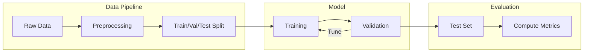
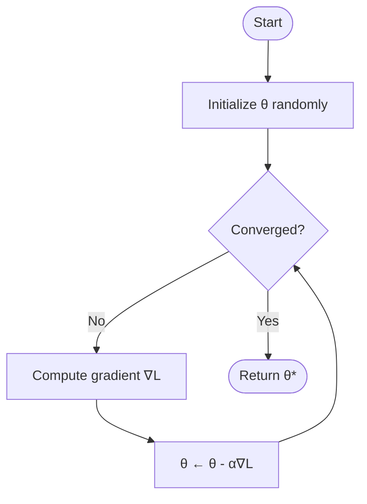
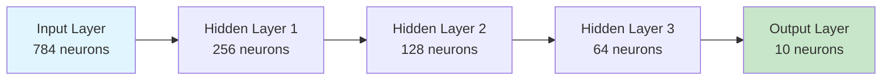

# Academic Papers

Markdown Viewer is ideal for writing academic papers with mathematical formulas, citations, and structured content. Export to Word for submission or further editing.

## Why Markdown for Academia?

| Advantage | Description |
|-----------|-------------|
| **Focus on Content** | No formatting distractions |
| **Version Control** | Track all revisions in Git |
| **Math Support** | Native LaTeX formulas |
| **Collaboration** | Easy diff/merge |
| **Export Options** | Word, PDF (via Word) |

---

## Paper Structure

### Standard Academic Paper

```markdown
# Paper Title: A Study of Something Important

**Authors:** John Smith¹, Jane Doe²

¹ Department of Computer Science, University A
² Department of Mathematics, University B

## Abstract

This paper presents a novel approach to... 
We demonstrate that... Our results show...

**Keywords:** machine learning, optimization, neural networks

---

## 1. Introduction

The problem of X has been widely studied [1, 2]. 
Previous approaches have limitations...

## 2. Related Work

Smith et al. [3] proposed... However, their method...

## 3. Methodology

### 3.1 Problem Formulation

Given a dataset $D = \{(x_i, y_i)\}_{i=1}^n$...

### 3.2 Proposed Approach

We propose a new algorithm that...

## 4. Experiments

### 4.1 Experimental Setup

### 4.2 Results

## 5. Conclusion

## References

[1] Author, "Title," Journal, 2023.
[2] Author, "Title," Conference, 2024.
```

---

## Mathematical Formulas

### Inline Math

```markdown
The relationship is given by $E = mc^2$ where $m$ is mass.
```

### Display Math

```markdown
The optimization objective is:

$$
\min_{\theta} \frac{1}{n} \sum_{i=1}^{n} \mathcal{L}(f_\theta(x_i), y_i) + \lambda \|\theta\|_2^2
$$
```

### Complex Equations

#### Systems of Equations

```markdown
$$
\begin{cases}
\frac{\partial u}{\partial t} = D_u \nabla^2 u - uv^2 + F(1-u) \\
\frac{\partial v}{\partial t} = D_v \nabla^2 v + uv^2 - (F+k)v
\end{cases}
$$
```

#### Matrices

```markdown
The transformation matrix is:

$$
\mathbf{A} = \begin{pmatrix}
\cos\theta & -\sin\theta & 0 \\
\sin\theta & \cos\theta & 0 \\
0 & 0 & 1
\end{pmatrix}
$$
```

#### Aligned Equations

```markdown
$$
\begin{aligned}
\nabla \cdot \mathbf{E} &= \frac{\rho}{\epsilon_0} \\
\nabla \cdot \mathbf{B} &= 0 \\
\nabla \times \mathbf{E} &= -\frac{\partial \mathbf{B}}{\partial t} \\
\nabla \times \mathbf{B} &= \mu_0 \mathbf{J} + \mu_0 \epsilon_0 \frac{\partial \mathbf{E}}{\partial t}
\end{aligned}
$$
```

---

## Figures and Diagrams

### Experimental Setup

````markdown

````

### Algorithm Flowchart

````markdown

````

### Network Architecture

````markdown

````

---

## Tables

### Results Table

```markdown
## Results

| Method | Accuracy | Precision | Recall | F1 Score |
|--------|----------|-----------|--------|----------|
| Baseline | 0.823 | 0.801 | 0.798 | 0.799 |
| Method A | 0.867 | 0.854 | 0.861 | 0.857 |
| **Ours** | **0.912** | **0.903** | **0.908** | **0.905** |

Table 1: Performance comparison on the test dataset.
```

### Hyperparameter Table

```markdown
| Parameter | Value | Description |
|-----------|-------|-------------|
| Learning rate | 0.001 | Adam optimizer |
| Batch size | 32 | Mini-batch SGD |
| Epochs | 100 | Early stopping at 10 |
| Dropout | 0.3 | Applied to hidden layers |
| Weight decay | 1e-5 | L2 regularization |

Table 2: Hyperparameter settings for all experiments.
```

---

## Data Visualization

### Performance Comparison Chart

````markdown
```vega-lite
{
  "data": {
    "values": [
      {"method": "Baseline", "metric": "Accuracy", "value": 0.823},
      {"method": "Method A", "metric": "Accuracy", "value": 0.867},
      {"method": "Ours", "metric": "Accuracy", "value": 0.912},
      {"method": "Baseline", "metric": "F1 Score", "value": 0.799},
      {"method": "Method A", "metric": "F1 Score", "value": 0.857},
      {"method": "Ours", "metric": "F1 Score", "value": 0.905}
    ]
  },
  "mark": "bar",
  "encoding": {
    "x": {"field": "method", "type": "nominal"},
    "y": {"field": "value", "type": "quantitative"},
    "color": {"field": "metric", "type": "nominal"},
    "xOffset": {"field": "metric"}
  }
}
```
````

### Training Curves

````markdown
```vega-lite
{
  "data": {
    "values": [
      {"epoch": 0, "loss": 2.5, "type": "train"},
      {"epoch": 20, "loss": 1.2, "type": "train"},
      {"epoch": 40, "loss": 0.6, "type": "train"},
      {"epoch": 60, "loss": 0.3, "type": "train"},
      {"epoch": 0, "loss": 2.6, "type": "val"},
      {"epoch": 20, "loss": 1.4, "type": "val"},
      {"epoch": 40, "loss": 0.9, "type": "val"},
      {"epoch": 60, "loss": 0.7, "type": "val"}
    ]
  },
  "mark": {"type": "line", "point": true},
  "encoding": {
    "x": {"field": "epoch", "type": "quantitative", "title": "Epoch"},
    "y": {"field": "loss", "type": "quantitative", "title": "Loss"},
    "color": {"field": "type", "type": "nominal", "title": "Dataset"}
  }
}
```
````

---

## Common Academic Formulas

### Statistics

```markdown
**Mean:** $\bar{x} = \frac{1}{n}\sum_{i=1}^{n} x_i$

**Variance:** $\sigma^2 = \frac{1}{n}\sum_{i=1}^{n}(x_i - \bar{x})^2$

**Standard Error:** $SE = \frac{s}{\sqrt{n}}$

**t-statistic:** $t = \frac{\bar{x} - \mu_0}{s/\sqrt{n}}$
```

### Machine Learning

```markdown
**Cross-Entropy Loss:**
$$H(p,q) = -\sum_{x} p(x) \log q(x)$$

**Softmax:**
$$\sigma(z_i) = \frac{e^{z_i}}{\sum_{j=1}^{K} e^{z_j}}$$

**Gradient Descent:**
$$\theta_{t+1} = \theta_t - \alpha \nabla_\theta L(\theta_t)$$
```

### Physics

```markdown
**Schrödinger Equation:**
$$i\hbar\frac{\partial}{\partial t}\Psi = \hat{H}\Psi$$

**Maxwell's Equations:**
$$\nabla \times \mathbf{E} = -\frac{\partial \mathbf{B}}{\partial t}$$
```

---

## Recommended Theme

For academic papers, use the **Academic** theme:

- Chinese body text: SimSun (宋体)
- Headings: SimHei (黑体)
- Line height: 1.75 (academic standard)
- Proper spacing for Chinese documents

For English papers, **Default** or **Palatino** work well.

---

## Export for Submission

### Export to Word

1. Finalize your paper in Markdown
2. Press `Ctrl/Cmd + S` to export
3. Open in Word for final touches:
   - Add page numbers
   - Adjust margins if needed
   - Final proofreading

### Key Benefits

- ✅ Formulas export as editable equations
- ✅ Diagrams become high-resolution images
- ✅ Tables properly formatted
- ✅ Code blocks syntax highlighted

---

## Tips for Academic Writing

### Math Formatting

- Use `\text{}` for words in formulas: $\text{accuracy} = \frac{TP + TN}{Total}$
- Use `\boldsymbol{}` for vectors: $\boldsymbol{x}$
- Use `\mathbf{}` for matrices: $\mathbf{A}$

### References

While Markdown doesn't have built-in citation support, you can:
- Use numbered references [1], [2]
- Keep a References section at the end
- Export to Word, then use Zotero/Mendeley for final formatting

### Version Control

```bash
# Commit regularly
git add paper.md
git commit -m "Add experimental results section"

# Branch for major revisions
git checkout -b revision-round-1
```
