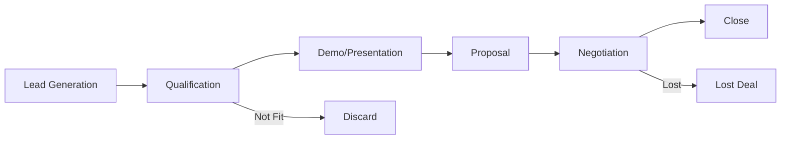
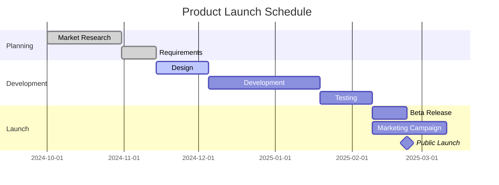
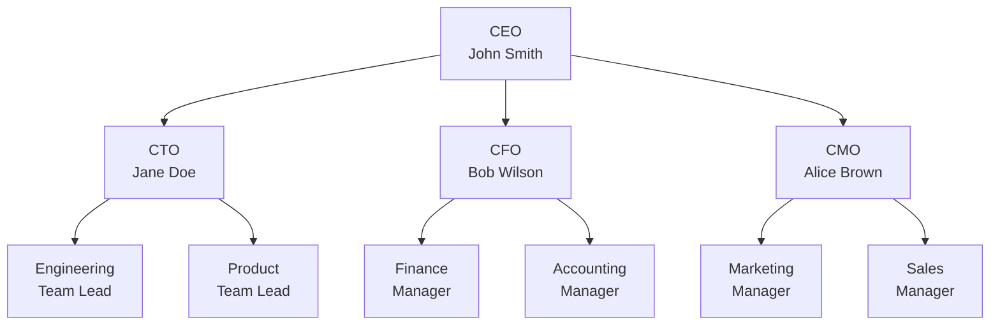

# Business Reports

Markdown Viewer makes creating professional business reports fast and easy. Write in Markdown, export to polished Word documents.

## Why Markdown for Business Reports?

| Benefit | Description |
|---------|-------------|
| **Speed** | Write faster than in Word |
| **Consistency** | Same format every time |
| **Data Updates** | Charts update with data |
| **Templates** | Reuse report structures |
| **Collaboration** | Easy review and merge |

---

## Report Templates

### Weekly Status Report

```markdown
# Weekly Status Report

**Week of:** January 15-19, 2025  
**Prepared by:** [Your Name]  
**Department:** [Department]

---

## Executive Summary

Brief overview of the week's accomplishments and challenges.

## Key Metrics

| Metric | Target | Actual | Status |
|--------|--------|--------|--------|
| Sales Revenue | $100K | $112K | ✅ |
| New Customers | 50 | 47 | ⚠️ |
| Support Tickets | <100 | 89 | ✅ |
| Uptime | 99.9% | 99.95% | ✅ |

## Accomplishments

- Launched new feature X
- Closed deal with Client Y
- Completed Q1 planning

## Challenges

- Delayed delivery from vendor
- Team member on sick leave

## Next Week's Priorities

1. Complete feature rollout
2. Prepare board presentation
3. Interview candidates

## Action Items

| Item | Owner | Due Date | Status |
|------|-------|----------|--------|
| Finalize budget | Finance | Jan 22 | In Progress |
| Review contracts | Legal | Jan 24 | Not Started |
```

### Quarterly Business Review

```markdown
# Q4 2024 Business Review

**Presented to:** Executive Team  
**Date:** January 2025

---

## Financial Summary

### Revenue Performance

| Quarter | Target | Actual | Variance |
|---------|--------|--------|----------|
| Q1 | $2.0M | $2.1M | +5% |
| Q2 | $2.2M | $2.4M | +9% |
| Q3 | $2.5M | $2.3M | -8% |
| Q4 | $3.0M | $3.2M | +7% |
| **YTD** | **$9.7M** | **$10.0M** | **+3%** |

### Key Financial Metrics

- **Gross Margin:** 68% (target: 65%)
- **Operating Expenses:** $6.2M (budget: $6.5M)
- **EBITDA:** $1.8M (target: $1.5M)

## Sales Performance

## Market Analysis

## Operational Highlights

## Challenges & Risks

## Q1 2025 Outlook

## Recommendations
```

---

## Data Visualizations

### Revenue Chart

````markdown
## Revenue Trend

```vega-lite
{
  "data": {
    "values": [
      {"month": "Jan", "revenue": 820},
      {"month": "Feb", "revenue": 890},
      {"month": "Mar", "revenue": 950},
      {"month": "Apr", "revenue": 880},
      {"month": "May", "revenue": 920},
      {"month": "Jun", "revenue": 1050},
      {"month": "Jul", "revenue": 980},
      {"month": "Aug", "revenue": 1100},
      {"month": "Sep", "revenue": 1150},
      {"month": "Oct", "revenue": 1080},
      {"month": "Nov", "revenue": 1200},
      {"month": "Dec", "revenue": 1350}
    ]
  },
  "mark": {"type": "line", "point": true, "color": "#1f77b4"},
  "encoding": {
    "x": {"field": "month", "type": "ordinal", "title": "Month"},
    "y": {"field": "revenue", "type": "quantitative", "title": "Revenue ($K)"}
  }
}
```
````

### Regional Sales Comparison

````markdown
## Sales by Region

```vega-lite
{
  "data": {
    "values": [
      {"region": "North America", "q3": 450, "q4": 520},
      {"region": "Europe", "q3": 380, "q4": 410},
      {"region": "Asia Pacific", "q3": 290, "q4": 350},
      {"region": "Latin America", "q3": 120, "q4": 145}
    ]
  },
  "transform": [
    {"fold": ["q3", "q4"], "as": ["quarter", "sales"]}
  ],
  "mark": "bar",
  "encoding": {
    "x": {"field": "region", "type": "nominal", "title": "Region"},
    "y": {"field": "sales", "type": "quantitative", "title": "Sales ($K)"},
    "color": {"field": "quarter", "type": "nominal", "title": "Quarter"},
    "xOffset": {"field": "quarter"}
  }
}
```
````

### Market Share Pie Chart

````markdown
## Market Share

```vega-lite
{
  "data": {
    "values": [
      {"company": "Our Company", "share": 35},
      {"company": "Competitor A", "share": 28},
      {"company": "Competitor B", "share": 20},
      {"company": "Others", "share": 17}
    ]
  },
  "mark": {"type": "arc", "innerRadius": 50},
  "encoding": {
    "theta": {"field": "share", "type": "quantitative"},
    "color": {"field": "company", "type": "nominal", "title": "Company"}
  }
}
```
````

### KPI Dashboard

````markdown
```infographic
infographic progress-chart
data
  title Q4 KPI Achievement
  items
    - label Revenue Target
      value 107
    - label Customer Acquisition
      value 94
    - label Customer Retention
      value 98
    - label NPS Score
      value 112
```
````

---

## Process Diagrams

### Sales Pipeline

````markdown
## Sales Process


````

### Project Timeline

````markdown
## Project Timeline


````

### Organizational Structure

````markdown
## Team Structure


````

---

## Financial Formulas

### Growth Calculations

```markdown
**Year-over-Year Growth:**
$$\text{YoY Growth} = \frac{\text{Current Year} - \text{Previous Year}}{\text{Previous Year}} \times 100\%$$

**CAGR (Compound Annual Growth Rate):**
$$\text{CAGR} = \left(\frac{V_{final}}{V_{initial}}\right)^{\frac{1}{n}} - 1$$

**Gross Margin:**
$$\text{Gross Margin} = \frac{\text{Revenue} - \text{COGS}}{\text{Revenue}} \times 100\%$$
```

### ROI Calculations

```markdown
**Return on Investment:**
$$\text{ROI} = \frac{\text{Net Profit}}{\text{Investment}} \times 100\%$$

**Payback Period:**
$$\text{Payback Period} = \frac{\text{Initial Investment}}{\text{Annual Cash Flow}}$$

**Net Present Value:**
$$NPV = \sum_{t=0}^{n} \frac{C_t}{(1+r)^t}$$
```

---

## Best Practices

### Report Structure

```markdown
# [Report Title]

## Executive Summary
Key takeaways in 2-3 paragraphs

## Key Metrics
Tables with RAG status indicators

## Analysis
Detailed breakdown with charts

## Recommendations
Actionable next steps

## Appendix
Supporting data
```

### Visual Indicators

Use emojis for quick status:
- ✅ On track / Achieved
- ⚠️ At risk / Below target
- ❌ Off track / Failed
- 📈 Increasing
- 📉 Decreasing

### Tables for Metrics

Keep metrics tables scannable:

| Metric | Target | Actual | Status |
|--------|--------|--------|--------|
| Revenue | $1M | $1.1M | ✅ +10% |
| Costs | $500K | $480K | ✅ -4% |
| Profit | $500K | $620K | ✅ +24% |

---

## Recommended Theme

For business reports, use the **Business** theme:

- Clean Calibri font
- Professional spacing
- High-contrast code blocks
- Executive-ready appearance

---

## Time Savings

| Task | Traditional Word | Markdown Viewer |
|------|------------------|-----------------|
| Weekly report | 45 min | 15 min |
| Quarterly review | 4 hours | 1.5 hours |
| Create 5 charts | 30 min | 10 min |
| Update data | Re-create charts | Edit values |

---

## Export and Share

1. **Write** your report in Markdown
2. **Preview** with live chart rendering
3. **Export** to Word with `Ctrl/Cmd + S`
4. **Share** the polished document

All charts and tables maintain professional formatting in the exported Word document.
