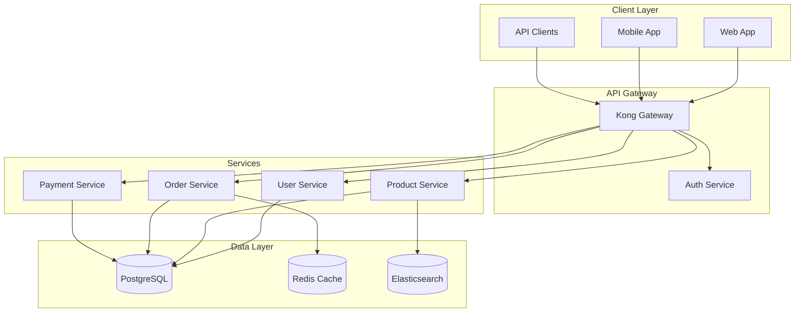
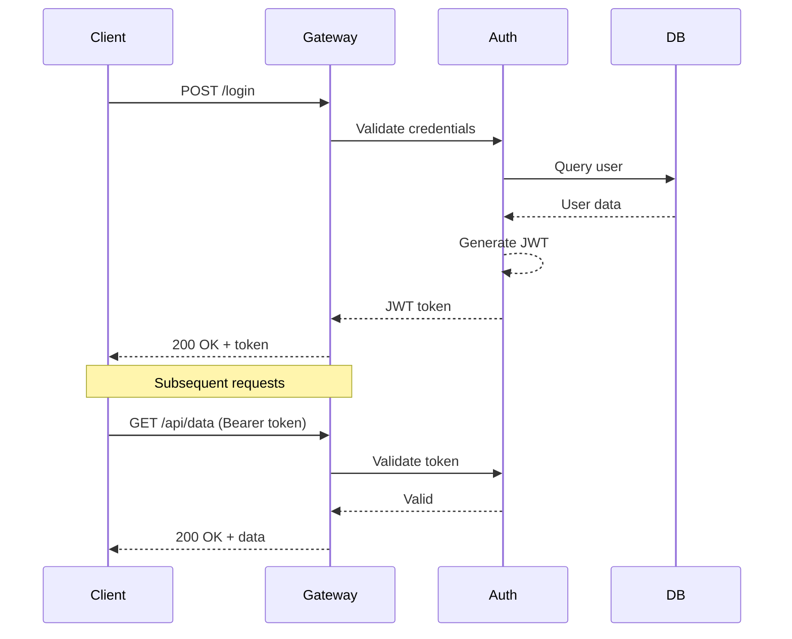
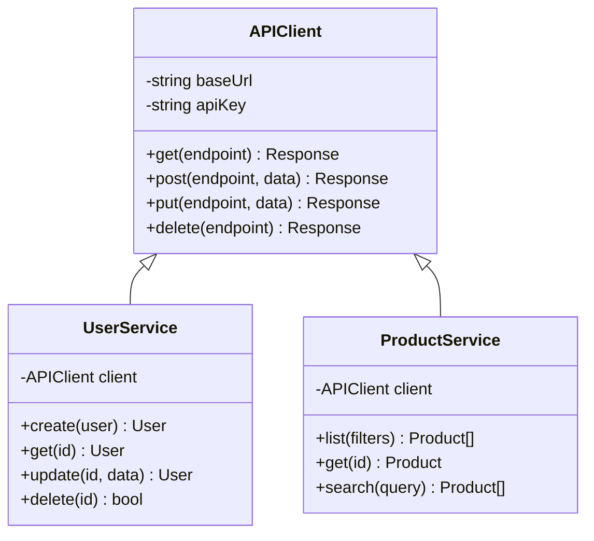
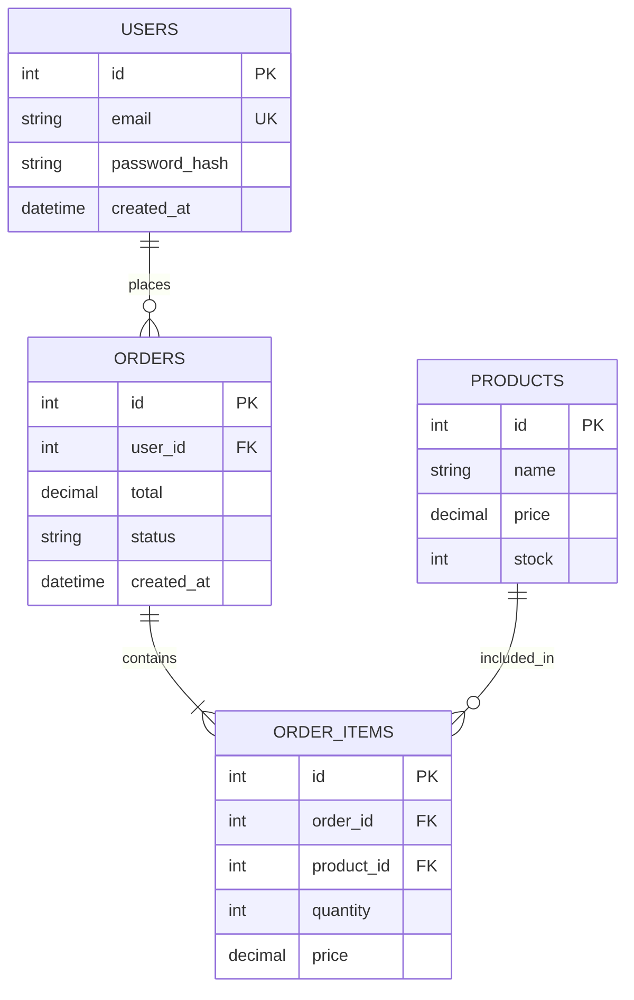
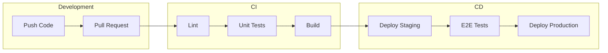
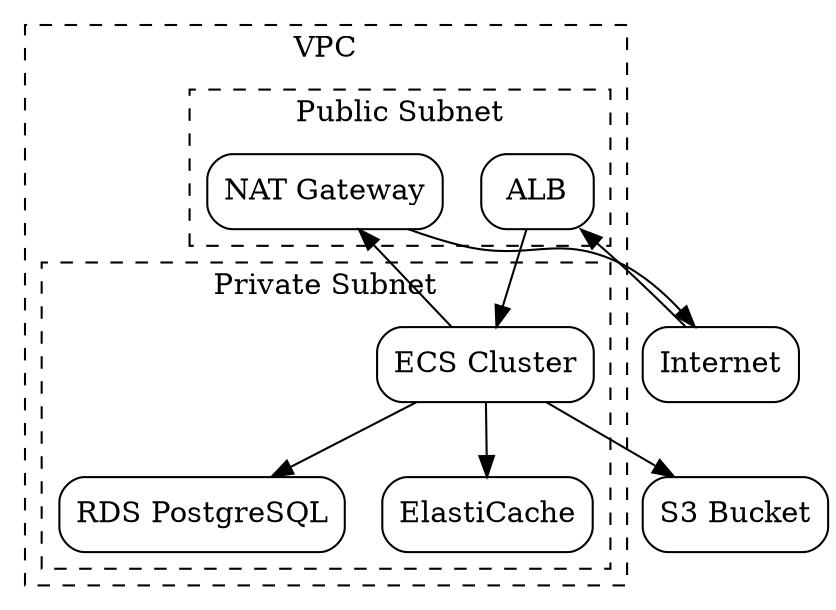

# Technical Documentation

Markdown Viewer excels at creating technical documentation with code, diagrams, and formulas. Here's how to use it effectively for tech docs.

## Why Use Markdown for Tech Docs?

| Advantage | Description |
|-----------|-------------|
| **Version Control** | Track changes in Git |
| **Plain Text** | Edit with any tool |
| **Portable** | Works everywhere |
| **Fast** | No loading times |
| **Collaborative** | Easy merge/diff |

---

## Perfect for Architecture Docs

### System Architecture

````markdown
## System Architecture

Our platform uses a microservices architecture:


````

### API Sequence Diagrams

````markdown
## Authentication Flow


````

---

## API Documentation

### Endpoint Documentation

````markdown
## User API

### Create User

`POST /api/users`

**Request Body:**

```json
{
  "name": "John Doe",
  "email": "john@example.com",
  "role": "admin"
}
```

**Response:**

```json
{
  "id": 123,
  "name": "John Doe",
  "email": "john@example.com",
  "role": "admin",
  "created_at": "2024-01-15T10:30:00Z"
}
```

**Status Codes:**

| Code | Description |
|------|-------------|
| 201 | User created |
| 400 | Invalid input |
| 409 | Email exists |
| 500 | Server error |
````

### Class Diagrams for SDKs

````markdown
## SDK Class Structure


````

---

## Database Documentation

### Entity Relationships

````markdown
## Database Schema


````

---

## DevOps & Infrastructure

### Deployment Pipelines

````markdown
## CI/CD Pipeline


````

### Infrastructure Topology

````markdown
## AWS Infrastructure


````

---

## Code Examples

### Syntax Highlighted Code

````markdown
## Installation

```bash
# Clone the repository
git clone https://github.com/company/project.git
cd project

# Install dependencies
npm install

# Configure environment
cp .env.example .env
vim .env

# Run migrations
npm run db:migrate

# Start development server
npm run dev
```

## Configuration

```typescript
// config/database.ts
import { DatabaseConfig } from './types';

export const config: DatabaseConfig = {
  host: process.env.DB_HOST || 'localhost',
  port: parseInt(process.env.DB_PORT || '5432'),
  database: process.env.DB_NAME || 'myapp',
  username: process.env.DB_USER || 'postgres',
  password: process.env.DB_PASSWORD,
  pool: {
    min: 2,
    max: 10,
    idleTimeoutMillis: 30000
  }
};
```
````

---

## Time Savings

| Document Type | Traditional | With Markdown Viewer |
|--------------|-------------|---------------------|
| API doc (10 endpoints) | 2 hours | 30 min |
| Architecture overview | 3 hours | 45 min |
| SDK documentation | 4 hours | 1 hour |
| Deployment guide | 1.5 hours | 20 min |

**Why faster?**
- No manual diagram drawing
- Code blocks auto-formatted
- One-click export to Word
- Version control friendly

---

## Best Practices

### Structure Your Docs

```markdown
# Project Name

## Overview
Brief description...

## Architecture
System diagrams...

## API Reference
Endpoint details...

## Configuration
Setup instructions...

## Deployment
How to deploy...

## Troubleshooting
Common issues...
```

### Use Consistent Diagrams

Pick a diagram type and stick with it:
- **Mermaid** for most diagrams
- **DOT** for complex graphs
- **Tables** for simple data

### Include Examples

Every API endpoint should have:
- Request example
- Response example
- Error examples

---

## Export to Word

When you need to share with non-technical stakeholders:

1. Open your documentation
2. Press `Ctrl/Cmd + S`
3. Share the Word document

All diagrams become high-resolution images, code keeps syntax highlighting.
